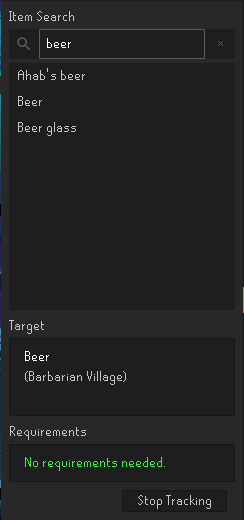
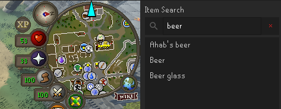
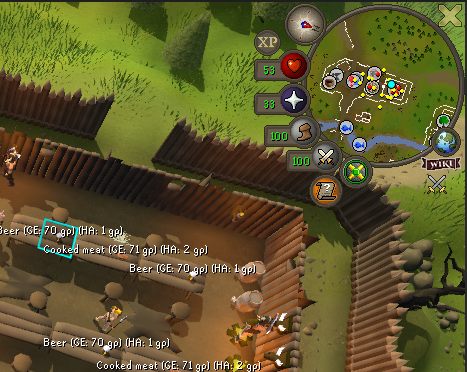
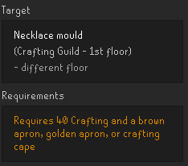
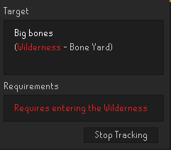

# Scavenger

A RuneLite plugin that finds the nearest free pickup location for common
ground-spawn items (tools, runes, food, and more) and points you to it with
a minimap arrow, a world map arrow, and a world tile highlight.

## Features

- Sidebar panel to search for an item by name
- Minimap arrow pointing toward the nearest known spawn of the selected item
- World map marker that blinks and, when the spawn is off-screen, turns into
  an arrow pointing toward it
- World-overlay tile highlight on the spawn location itself
- Cave/dungeon spawns route you to the entrance first, then switch to the
  actual spawn tile once you're inside
- Free-to-play / members filtering, so F2P accounts aren't pointed at
  members-only spawns (**Account type** setting in the plugin config)
- Spawn data for 370+ items sourced from the OSRS Wiki

## Installing

Scavenger is available on the [RuneLite Plugin Hub](https://runelite.net/plugin-hub).
In the RuneLite client, open the Plugin Hub (the puzzle-piece icon in the
sidebar), search for "Scavenger", and click install.

## Using Scavenger

Click the Scavenger icon in the RuneLite sidebar to open the search panel,
type an item name, and select it from the results. The minimap arrow, world
map marker, and world tile highlight will all point to the nearest known
spawn. Click "Stop Tracking" to clear it.

## Screenshots

Searching for an item and tracking its nearest spawn:



Minimap arrow pointing toward the nearest spawn:



World tile highlight on the spawn location:



Skill/quest requirements are called out in orange:



Wilderness spawns are flagged in red:



## Building from source (development)

**Prerequisites:**

- **JDK 11** — install from [Adoptium](https://adoptium.net/temurin/releases/?version=11)
  and make sure `JAVA_HOME` points at it.
- **Git**
- A **Jagex account** linked to your game account — required to log into the
  development client. See RuneLite's guide:
  https://github.com/runelite/runelite/wiki/Using-Jagex-Accounts

**Steps:**

```
git clone https://github.com/guobmin/runelite-scavenger.git
cd runelite-scavenger
./gradlew run          # Windows: .\gradlew.bat run
```

The first run downloads Gradle and RuneLite client dependencies, so it can
take a few minutes. Once it finishes, a RuneLite window opens in developer
mode with Scavenger already loaded — sign in with the Jagex account above.

## Updating item data

Spawn locations live in `src/main/resources/com/scavenger/items.json` and
are generated from the OSRS Wiki by a separate Python scraper (not part of
the plugin build, untracked from this repo — see `.gitignore`). The data was
built via `list=embeddedin` against `Template:ItemSpawnLine` on the OSRS Wiki
API to enumerate every item page with known spawn coordinates.

## Help and issues

Spawn data is scraped from the OSRS Wiki and hasn't been rigorously tested
against every item in-game yet, so some spawns may be missing or wrong.

Found a bug, a missing item, or have a suggestion?
[Open an issue](https://github.com/guobmin/runelite-scavenger/issues/new).

## License

BSD-2-Clause.
